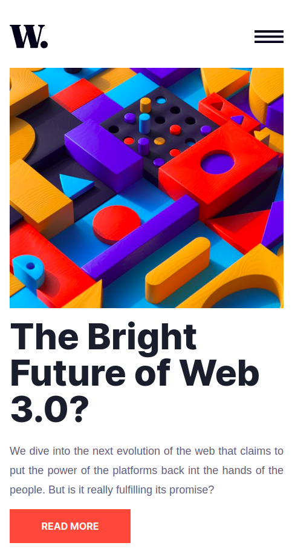

# Frontend Mentor - News homepage solution

This is a solution to the [News homepage challenge on Frontend Mentor](https://www.frontendmentor.io/challenges/news-homepage-H6SWTa1MFl). Frontend Mentor challenges help you improve your coding skills by building realistic projects. 

## Table of contents

- [Frontend Mentor - News homepage solution](#frontend-mentor---news-homepage-solution)
  - [Table of contents](#table-of-contents)
  - [Overview](#overview)
    - [The challenge](#the-challenge)
    - [Screenshot](#screenshot)
    - [Links](#links)
  - [My process](#my-process)
    - [Built with](#built-with)
    - [What I learned](#what-i-learned)
  - [Author](#author)

## Overview

### The challenge

Users should be able to:

- View the optimal layout for the interface depending on their device's screen size
- See hover and focus states for all interactive elements on the page
- **Bonus**: Toggle the mobile menu (requires some JavaScript)

### Screenshot

### Links

- Solution URL: [Github URL](https://github.com/IanMcbull/front-end-mentor-news-homepage)
- Live Site URL: [Live URL](https://curious-frangipane-02d009.netlify.app/)

## My process

### Built with

- React
- Tailwindcss
- Typescript
- Mobile-first workflow
- [React](https://reactjs.org/) - JS library
- [TailwindCSS](https://tailwindcss.com/) - CSS framework
- [Chakra UI](https://chakra-ui.com/) - React Component Library

**Note: These are just examples. Delete this note and replace the list above with your own choices**

### What I learned

I've been working on challenges that have designs that will allow me to work on my CSS Grid skills. This challenge was perfect for that. I've also been trying to get better at building responsive websites and trying to follow the mobile first design pattern.

## Author

- Website - [Ian Mugenya](https://curious-beijinho-840b34.netlify.app/)
- Frontend Mentor - [@IanMcbull](https://www.frontendmentor.io/profile/IanMcbull)
- Twitter - [@Mcbool](https://twitter.com/McBooll)

